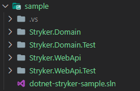

# Stryker.MultipleProjectRunner

This project was created to improve a good solution the I found aboult, how to run Stryker.Net in multiple projects. I changed some things, then I prefered to create a fork to do this. If you wish, check the [base code](https://github.com/rajbos/Stryker.MultipleProjectRunner).

- Updates:
  - Changed the `Stryker.data.json` to `stryker-config.json`.
  - Used relative path to find projects.
  - Added logs to informate new steps.
  - Added validations when loading `stryker-config.json`.
  - Added date to report.

## Resume

Runs Stryker for multiple .NET Core projects and aggregates the results, based on [this GitHub conversation](https://github.com/stryker-mutator/stryker-net/issues/740).

TL;DR: Stryker cannot run for an entire solution with multiple test projects (YET), so we need to help it a little and run each project by itself and then join the results.

### Note

This is a first draft and could use some more error handling 😄author 😄I.

## Requirements

- Install dotnet core
- Install global dotnet core tool for Stryker: `dotnet tool install -g dotnet-stryker`
- `git clone` or `download` this repository somewhere
- Update the datafile with your files. See `DATAFILE` below.

Use the sample to test.

## Running this script

Just call the script. It creates an Output directory from your starting path and will save all output files there

Files needed:

- RunStryker.ps1
- stryker-config.json
- StrykerReportEmpty.html

## What will happen?

The data file will be read from disk. Each project in the "projectsToTest" setting will be send to a Stryker run. The last generated json file from that run will be copied with a datetime in the filename to the `jsonReportsPath` path.
After all runs have been completed, the json files in the Output directory will be joined and copied into the empty report html file by matter of string replacement. A JavaScript file from the Stryker CDN will be added to the html report as well.

The html report will be stand-alone after the run.

## Project Scheme

To work with this script , you need to pay attention to the project scheme.

 

 

## DATAFILE (stryker-config.json)

In the datafile the following properties should be set:

| Property       | Example                     | Description                                      |
| -------------- | --------------------------- | ------------------------------------------------ |
| sourcePath     | `.\\sample`                 | The relative path to source code                 |
| solutionName   | `dotnet-stryker-sample.sln` | Only name of the solution inside the source code |
| projectsToTest | see below                   | Array of projects to run                         |

### ProjectsToTest array

The projectsToTest property is an array of items with these properties:

| Property   | Example                 | Description                                          |
| ---------- | ----------------------- | ---------------------------------------------------- |
| csProjPath | `Stryker.WebApi.csproj` | FileName of the project file to mutate               |
| testDir    | `Stryker.WebApi.Test`   | DirectoryName of the test folder to run the tests in |
